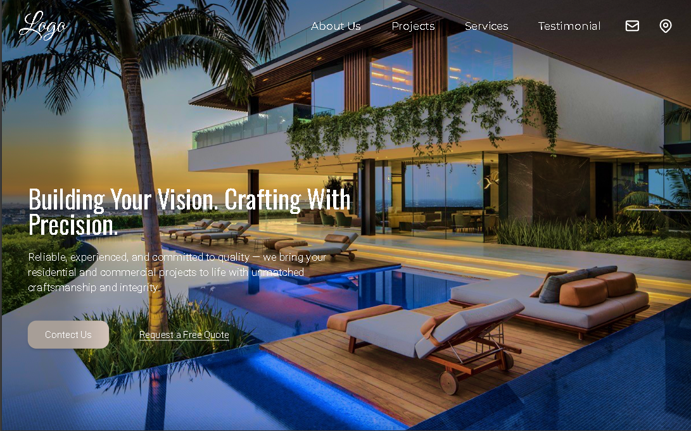

# 🏗️ Construction Company Website

A clean and responsive website for a fictional construction company. Designed to showcase services, portfolio, and contact information with a professional layout and smooth user experience.

### 🔗 Live Demo
👉 [View Live Site](https://askweb9.netlify.app/)

---

## 🚀 Features

- Responsive landing page
- Smooth scroll navigation
- Service sections with icons
- Project showcase/gallery
- Simple contact form UI
- Clean layout with Tailwind utility classes

---

## 🧰 Tech Stack

- HTML
- Tailwind CSS (CDN)
- JavaScript
- Netlify (for deployment)

---

## 📸 Screenshots



---

## 📦 Getting Started

1. Clone the repo:
```bash
git clone https://github.com/abdulsalamkhan441/Construction-website.git
